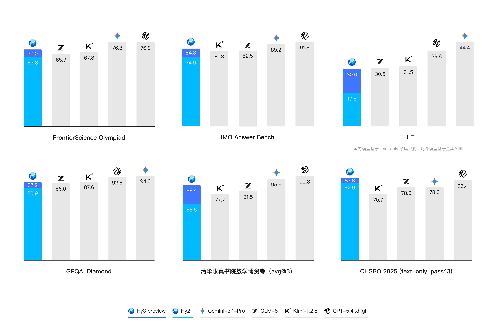
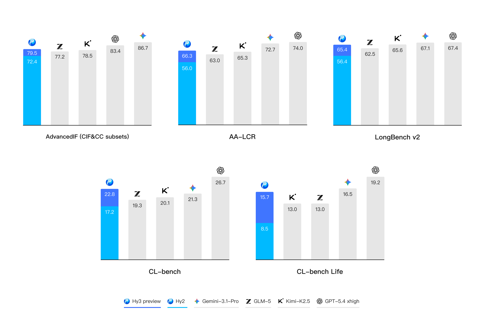
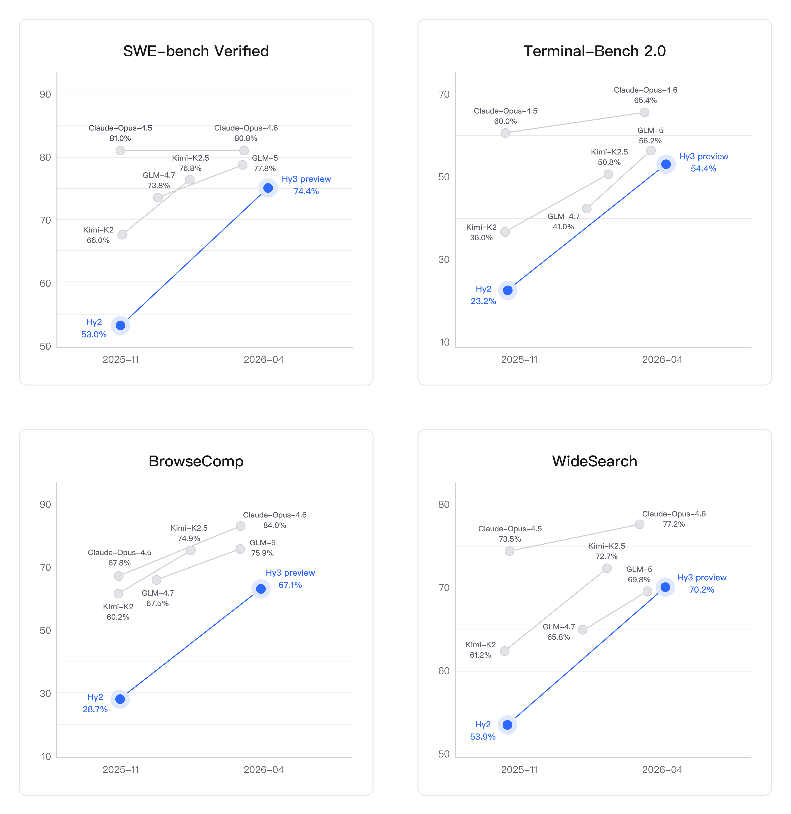
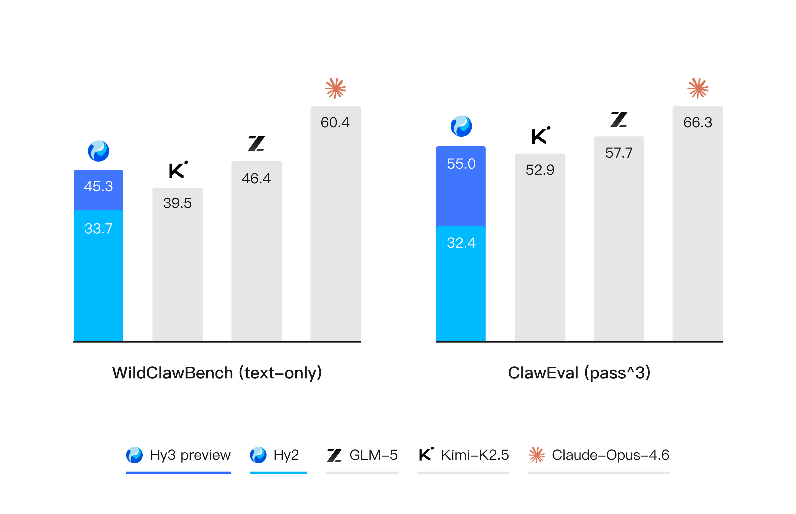
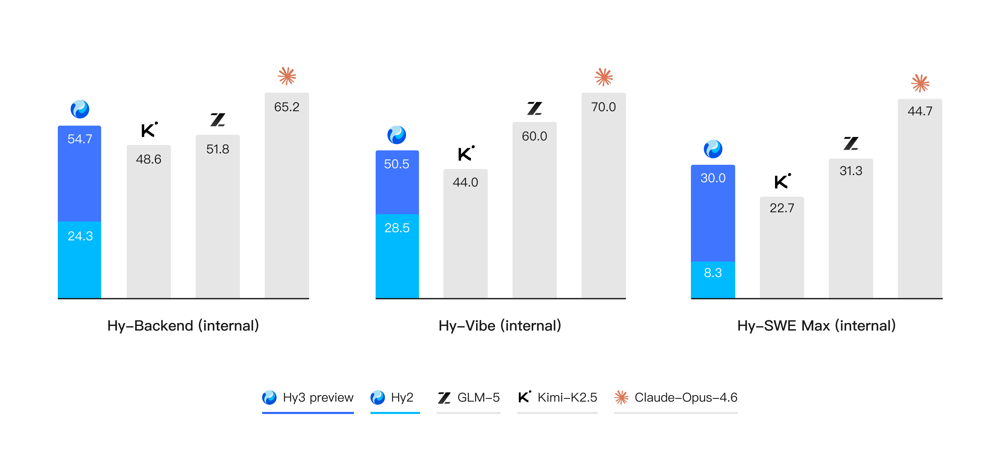

<p align="left">
   <a href="README.md">English</a>&nbsp;｜&nbsp;中文
</p>
<br>

<p align="center">
  <br>
</p>

<div align="center" style="line-height: 1;">


[](#许可证)
&nbsp;&nbsp;
[](https://huggingface.co/tencent/Hy3-preview)
&nbsp;&nbsp;
[](https://modelscope.cn/models/Tencent-Hunyuan/Hy3-preview)
&nbsp;&nbsp;
[](https://cnb.cool/ai-models/tencent/Hy3-preview)
&nbsp;&nbsp;
[](https://ai.gitcode.com/tencent_hunyuan/Hy3-preview)

</div>

<p align="center">
    🖥️&nbsp;<a href="https://aistudio.tencent.com/"><b>官方网站</b></a>&nbsp;&nbsp;|&nbsp;&nbsp;
    💬&nbsp;<a href="https://github.com/Tencent-Hunyuan/Hy3-preview"><b>GitHub</b></a></p>

---

## 目录

- [模型介绍](#模型介绍)
- [亮点展示](#亮点展示)
- [评测结果](#评测结果)
  - [复杂推理（STEM & Reasoning）](#复杂推理stem--reasoning)
  - [上下文学习和指令遵循（Context Learning & Instruction Following）](#上下文学习和指令遵循context-learning--instruction-following)
  - [代码和智能体（Code & Agent）](#代码和智能体code--agent)
- [新闻](#新闻)
- [模型链接](#模型链接)
- [快速开始](#快速开始)
- [推理和部署](#推理和部署)
  - [vLLM](#使用-vllm-推理)
  - [SGLang](#使用-sglang-推理)
- [模型训练](#模型训练)
- [量化工具](#量化工具)
- [许可证](#许可证)
- [联系我们](#联系我们)

---

## 模型介绍

**Hy3 preview** 是由腾讯混元团队研发的快慢思考融合的混合专家模型，总参数量 295B，激活参数 21B，MTP 层参数 3.8B。Hy3 preview 是我们重建后训练的第一个模型，也是混元迄今最智能的模型，在复杂推理、指令遵循、上下文学习、代码、智能体等能力及推理性能上实现了大幅的提升。


| 属性 | 值 |
|:---|:---|
| 架构 | 混合专家（MoE） |
| 总参数量 | 295B |
| 激活参数量 | 21B |
| MTP层参数量 | 3.8B |
| 层数（不含MTP层） | 80 |
| MTP层数 | 1 |
| 注意力头 | 64（GQA，8 个 KV 头，head dim 128） |
| 隐藏层维度 | 4096 |
| FFN 中间层维度 | 13312 |
| 上下文长度 | 256K |
| 词表大小 | 120832 |
| 专家数量 | 192 个专家，top-8 激活 |
| 支持精度 | BF16 |

## 亮点展示

- **复杂推理（STEM & Reasoning）** — 推理能力是模型解决各种问题的基础。在 FrontierScience-Olympiad、IMOAnswerBench 等高难度理工科推理任务中表现突出，并在最新的清华大学求真书院数学博资考（26春）和全国中学生生物学联赛（CHSBO 2025）中取得优异成绩，展现出可泛化的强推理能力。

- **上下文学习和指令遵循（Context Learning & Instruction Following）** — 在各种真实的生产与生活场景，理解杂乱冗长的上下文并遵从复杂多变的规则是模型的首要挑战。基于我们多种业务场景的灵感，我们提出了 CL-bench 和 CL-bench-Life 来创新性地评估模型的上下文学习能力，并在 Hy3 preview 显著地提升了模型上下文学习和指令遵循能力。

- **代码和智能体（Code & Agent）** — Hy3 preview 提升最为显著的方向。得益于预训练及强化学习框架的重建和强化学习任务规模的提升，我们以较快的速度在 SWE-Bench Verified、Terminal-Bench 2.0 等主流代码智能体基准以及 BrowseComp、WideSearch 等主流搜索智能体基准中取得了强竞争力的结果。

## 评测结果

### 预训练模型效果

| Category | Benchmark (Metric) | # Shots | Kimi-K2 BASE | DeepSeek-V3 BASE | GLM-4.5 BASE | Hy3 preview-Base |
|---|---|---|---|---|---|---|
| | #ActivatedParams | - | 32B | 37B | 32B | 21B |
| | #TotalParams | - | 1043B | 671B | 355B | 295B |
| **English** | MMLU | 5-shot | **88.24** | 87.68 | 87.73 | 87.42 |
| | MMLU-Pro | 5-shot | **65.98** | 63.98 | 63.67 | 65.76 |
| | MMLU-Redux | 5-shot | **87.18** | 86.81 | 86.56 | 86.86 |
| | ARC-Challenge | 0-shot | **96.66** | 94.65 | 96.32 | 95.99 |
| | DROP | 5-shot | 86.40 | **86.50** | 82.90 | 85.50 |
| | PIQA | 4-shot | **84.93** | 84.22 | 84.71 | 84.39 |
| | SuperGPQA | 5-shot | 51.10 | 46.17 | 49.64 | **51.60** |
| | SimpleQA | 5-shot | **34.37** | 26.15 | 29.26 | 26.47 |
| **Code** | MBPP-plus | 3-shot | **81.35** | 75.47 | 78.05 | 78.71 |
| | CRUXEval-I | 3-shot | 68.01 | 67.79 | 68.51 | **71.19** |
| | CRUXEval-O | 3-shot | 69.62 | **71.00** | 67.75 | 68.38 |
| | LiveCodeBench-v6 | 1-shot | 30.86 | 29.31 | 27.43 | **34.86** |
| **Math** | GSM8K | 4-shot | 93.46 | 88.15 | 90.06 | **95.37** |
| | MATH | 4-shot | 71.20 | 59.37 | 61.00 | **76.28** |
| | CMath | 4-shot | 90.83 | 85.50 | 89.33 | **91.17** |
| **Chinese** | C-Eval | 5-shot | **91.51** | 90.35 | 85.84 | 89.80 |
| | CMMLU | 5-shot | **90.72** | 87.90 | 86.46 | 89.61 |
| | Chinese-simpleQA | 5-shot | **74.58** | 68.72 | 68.49 | 69.73 |
| **Multilingual** | MMMLU | 5-shot | 77.63 | 79.54 | 79.26 | **80.15** |
| | INCLUDE | 5-shot | 75.66 | 77.86 | 76.27 | **78.64** |

### Instruct 模型效果

#### 复杂推理（STEM & Reasoning）

推理能力是模型解决各种问题的基础。Hy3 preview 在 FrontierScience-Olympiad、IMOAnswerBench 等高难度理工科推理任务中表现突出，并在最新的清华大学求真书院数学博资考（26春）和全国中学生生物学联赛（CHSBO 2025）中取得优异成绩，展现出可泛化的强推理能力。

<p align="center"></p>

#### 上下文学习和指令遵循（Context Learning & Instruction Following）

在各种真实的生产与生活场景，理解杂乱冗长的上下文并遵从复杂多变的规则是模型的首要挑战。基于我们多种业务场景的灵感，我们提出了 CL-bench 和 CL-bench-Life 来创新性地评估模型的上下文学习能力，并在 Hy3 preview 显著地提升了模型上下文学习和指令遵循能力。

<p align="center"></p>

#### 代码和智能体（Code & Agent）

代码和智能体是 Hy3 preview 提升最为显著的方向。得益于预训练及强化学习框架的重建和强化学习任务规模的提升，我们以较快的速度在 SWE-Bench Verified、Terminal-Bench 2.0 等主流代码智能体基准以及 BrowseComp、WideSearch 等主流搜索智能体基准中取得了强竞争力的结果。

<p align="center"></p>

在数字世界中，代码关注的是模型在开发环境中的执行能力，搜索则聚焦于开放信息空间中的检索、筛选与整合能力，两者共同决定了模型在复杂智能体场景（例如 OpenClaw）中是否真正具备可用性。Hy3 preview 在 ClawEval 和 WildClawBench 等评测中表现突出，进一步表明我们的智能体能力的全面与实用性。

<p align="center"></p>

除了公开榜单，我们进一步构建了多个内部的评测集，对模型在真实开发场景中的表现进行评估。结果表明，无论是在后端工程任务集 Hy-Backend，贴近真实用户开发交互的 Hy-Vibe Bench，还是高难度软件工程开发任务集 Hy-SWE Max 上，Hy3 preview 均体现出了强竞争力。

<p align="center"></p>

## 新闻

* **[2026-04-23]** 🔥 我们在 [Hugging Face](https://huggingface.co/tencent/Hy3-preview)、[ModelScope](https://modelscope.cn/models/Tencent-Hunyuan/Hy3-preview) 和 [GitCode](https://ai.gitcode.com/tencent_hunyuan/Hy3-preview) 开源了 **Hy3 preview** 模型权重。

## 模型链接


| 模型名 | 简介 | Hugging Face | ModelScope | GitCode |
|:---|:---|:---:|:---:|:---:|
| Hy3 preview | Instruct 模型 | 🤗 [Model](https://huggingface.co/tencent/Hy3-preview) | [Model](https://modelscope.cn/models/Tencent-Hunyuan/Hy3-preview) | [Model](https://ai.gitcode.com/tencent_hunyuan/Hy3-preview) |
| Hy3 preview-Base | 预训练基座模型 | 🤗 [Model](https://huggingface.co/tencent/Hy3-preview-Base) | [Model](https://modelscope.cn/models/Tencent-Hunyuan/Hy3-preview-Base) | [Model](https://ai.gitcode.com/tencent_hunyuan/Hy3-preview-Base) |

## 快速开始

建议先通过 [vLLM](#使用-vllm-推理) 或 [SGLang](#使用-sglang-推理) 部署服务，然后通过 OpenAI 兼容 API 调用：

```python
from openai import OpenAI

client = OpenAI(base_url="http://localhost:8000/v1", api_key="EMPTY")

response = client.chat.completions.create(
    model="hy3-preview",
    messages=[
        {"role": "user", "content": "你好！请简单介绍一下你自己。"},
    ],
    temperature=0.9,
    top_p=1.0,
    # reasoning_effort: "no_think"（默认，直接回复）、"low"、"high"（深度思维链）
    extra_body={"chat_template_kwargs": {"reasoning_effort": "no_think"}},
)
print(response.choices[0].message.content)
```

> **推荐参数**：`temperature=0.9`，`top_p=1.0`。
>
> **推理模式**：复杂任务（数学、编程、推理）建议设置 `reasoning_effort="high"`，日常对话可使用默认的 `"no_think"` 直接回复。

具体部署方式请参考下方[推理和部署](#推理和部署)章节。

## 推理和部署

Hy3-preview 总参数量为 295B，当使用 8 张 GPU 时，建议使用 H20-3e 或其他有更大显存的卡型。

### vLLM

从源码构建 vLLM：

```bash
uv venv --python 3.12 --seed --managed-python
source .venv/bin/activate
git clone https://github.com/vllm-project/vllm.git
cd vllm
uv pip install --editable . --torch-backend=auto
```

启动 vLLM 服务，开启 MTP：

```bash
vllm serve tencent/Hy3-preview \
  --tensor-parallel-size 8 \
  --speculative-config.method mtp \
  --speculative-config.num_speculative_tokens 1 \
  --tool-call-parser hy_v3 \
  --reasoning-parser hy_v3 \
  --enable-auto-tool-choice \
  --served-model-name hy3-preview
```

### SGLang

从源码构建 SGLang：

```bash
git clone https://github.com/sgl-project/sglang
cd sglang
pip3 install pip --upgrade
pip3 install "transformers>=5.6.0"
pip3 install -e "python"
```

启动 SGLang 服务，开启 MTP：

```bash
python3 -m sglang.launch_server \
  --model tencent/Hy3-preview \
  --tp 8 \
  --tool-call-parser hunyuan \
  --reasoning-parser hunyuan \
  --speculative-num-steps 1 \
  --speculative-eagle-topk 1 \
  --speculative-num-draft-tokens 2 \
  --speculative-algorithm EAGLE \
  --served-model-name hy3-preview
```

## 模型训练

Hy3 preview 提供了完整的模型训练流程，支持全量微调和 LoRA 微调，同时支持 DeepSpeed ZeRO 多种配置以及 LLaMA-Factory 集成。

详细的训练文档请参考：[模型训练指南](./train/README_CN.md)

## 量化工具

我们提供了 [AngelSlim](https://github.com/tencent/AngelSlim)——一套易用、全面、高效的大模型压缩工具包，涵盖常用量化算法、低比特量化和投机采样等能力。

## 许可证


Hy3 preview 基于 **腾讯混元社区许可协议** 发布。详情请参阅 [LICENSE](./LICENSE)。

## 联系我们

如有问题或建议，欢迎通过邮件联系我们：

📧 **hunyuan_opensource@tencent.com**

---

<p align="center">
  <i>Hy3 preview 由腾讯混元团队研发。</i>
</p>
